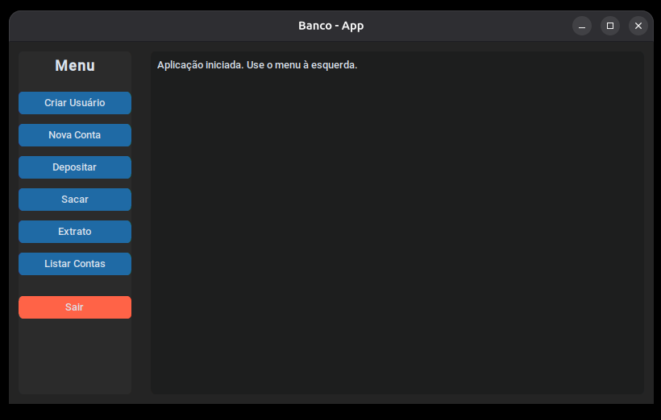
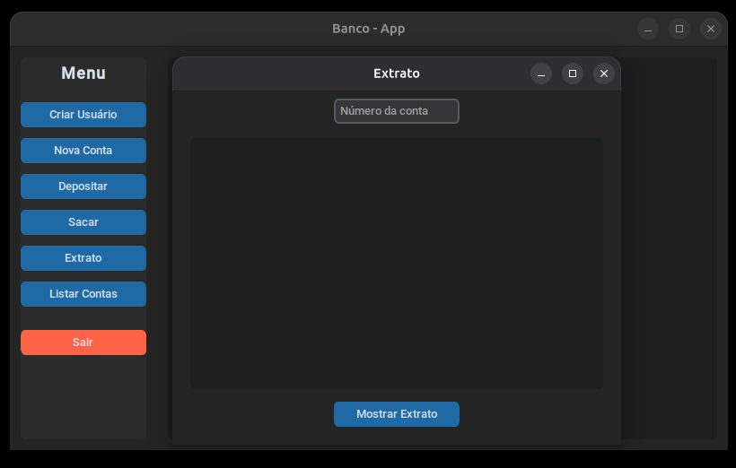
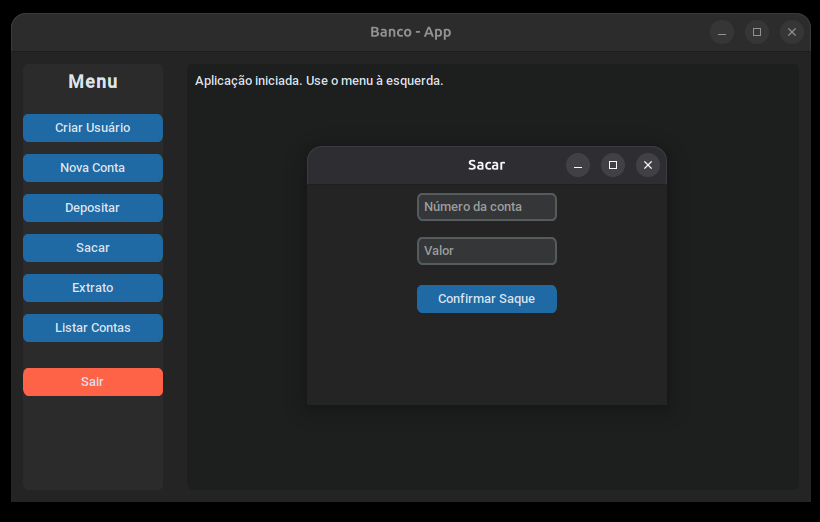
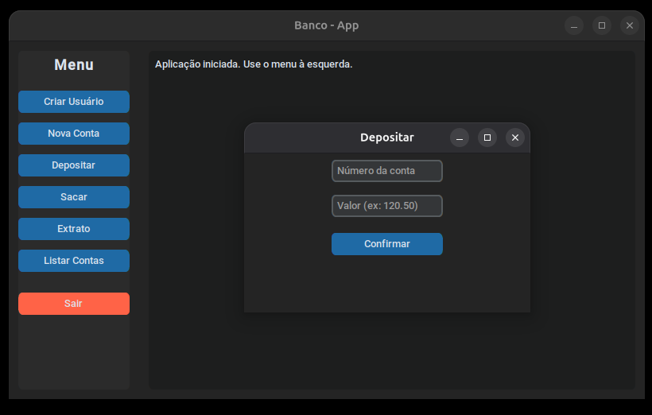
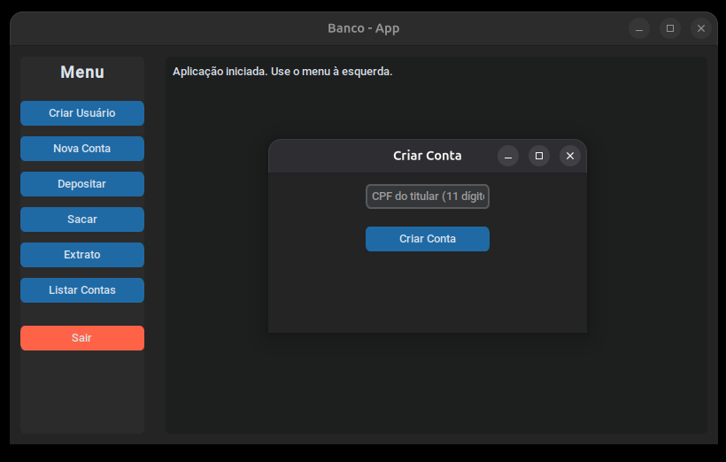
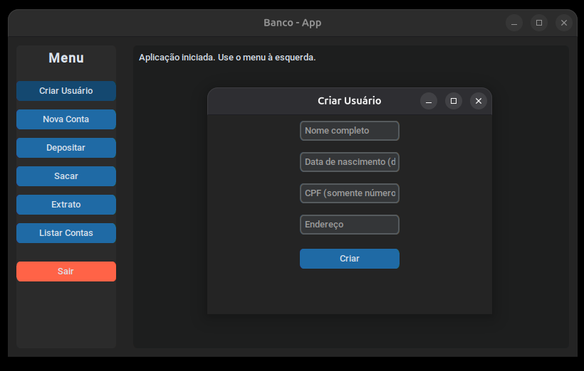

<h1 align="center">🏦 Projeto Banco - Interface Gráfica em Python</h1>

<p align="center">
  
  
  
</p>

---

## 📌 Sobre o projeto
Este é um **Sistema Bancário** desenvolvido em **Python 3.13** com interface gráfica construída utilizando **CustomTkinter**.

A aplicação simula operações bancárias como:
- Cadastro de usuários
- Criação de contas
- Depósitos
- Saques
- Consulta de extratos
- Listagem de contas

Com um design moderno, organizado e responsivo, este projeto é perfeito para estudos de **Python OOP**, **Tkinter/CustomTkinter** e boas práticas de estrutura de código.

---

## 🖼️ Screenshot



> Interface amigável e totalmente funcional.

---



> Janela Extrato.

---



> Janela Sacar.

---



> Janela Depósito.

---



> Janela Criar Conta.

---



> Janela Criar Usuário.

## 🚀 Tecnologias utilizadas

- **Python 3.13**
- **CustomTkinter**
- **Programação Orientada a Objetos (POO)**

---

## 📂 Estrutura do Projeto

```
projeto_banco.psy/
│
├── src/
│ ├── interface/
│ │ └── gui.py      # Interface gráfica
│ ├── models/
│ │ ├── banco.py    # Lógica de negócio do banco
│ │ ├── conta.py    # Classe de conta
│ │ └── usuario.py  # Classe de usuário
│ ├── main_cli.py   # Interface de linha de comando
│ ├── main_gui.py   # Inicia a aplicação gráfica
│ └── teste_gui.py  # Teste rápido da GUI
│
├── README.md
└── requirements.txt
```

---

## ⚙️ Como executar

***1️⃣ Clone o repositório***

```bash
git clone https://github.com/seu-usuario/projeto_banco.psy.git
cd projeto_banco.psy
```
***2️⃣ Crie e ative o ambiente virtual***
```
python -m venv venv
source venv/bin/activate  # Linux/Mac
venv\Scripts\activate     # Windows
```
***3️⃣ Instale as dependências***
```
pip install -r requirements.txt
```
***4️⃣ Execute a aplicação gráfica***
```
python -m src.main_gui
```
## 👤 Desenvolvido por
- [LinkedIn](https://www.linkedin.com/in/gustavo-nunnes) *(gustavo-nunnes)*
- Email: **gustavonunnes@hotmail.com**
- GitHub: [@GNunnes](https://github.com/GNunnes)